---

title: "Introduction to DevOps"
date: 2022-11-28T11:00:00+05:00
tags: ["AWS","DevOps", "DevSecOps", "QA", "Operations", "Culture"]
author: "Umer Jamil"

---

# Introduction to DevOps  

DevOps is the evolution of software development lifecycle. Last week, at [Rayn](https://www.rayn.group/), I gave a talk on DevOps, the process, the methodology, and how adopting DevOps can help IT and business team. The presentation content is as follows:

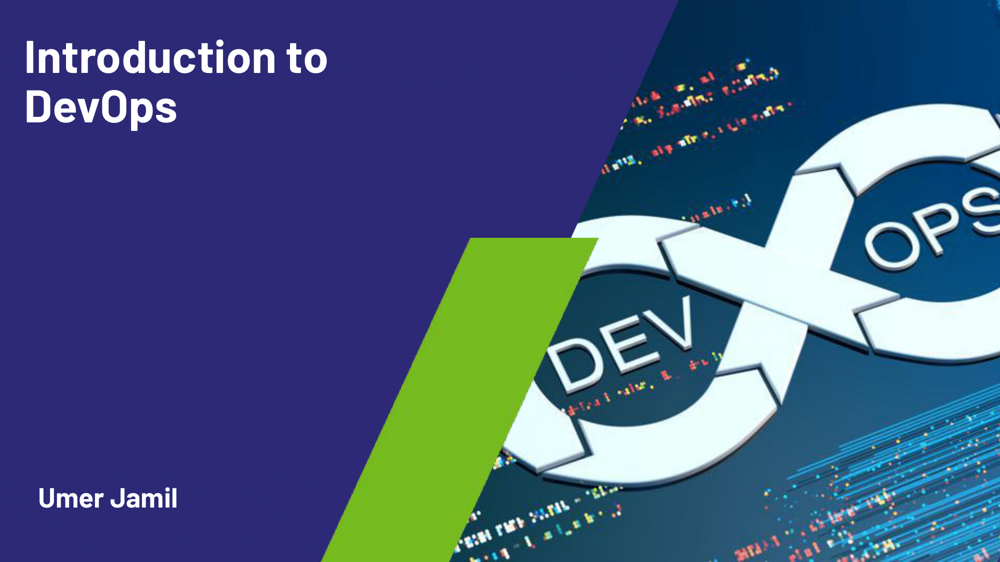
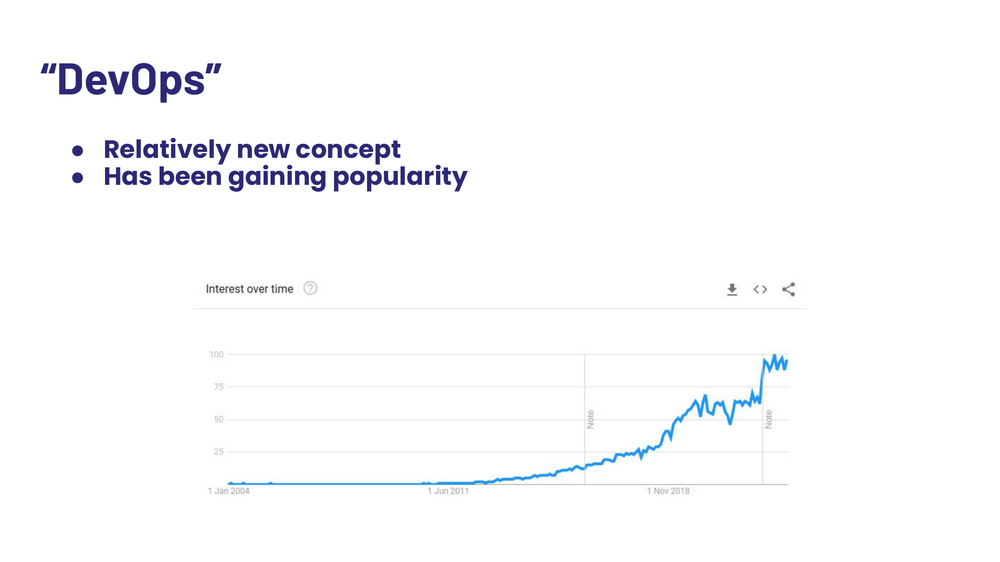
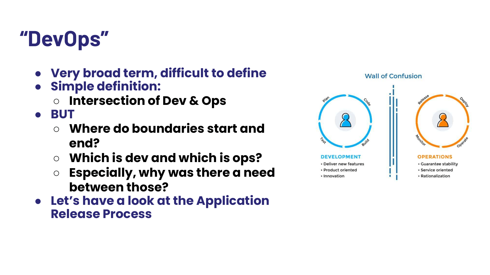
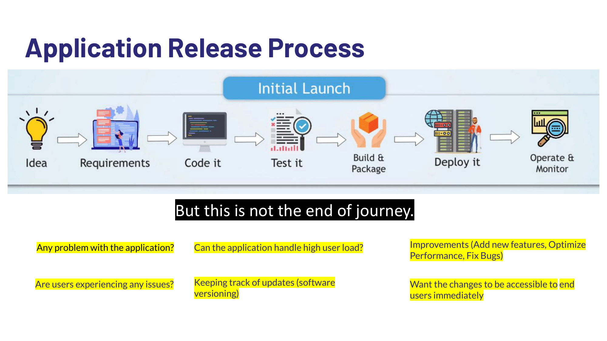
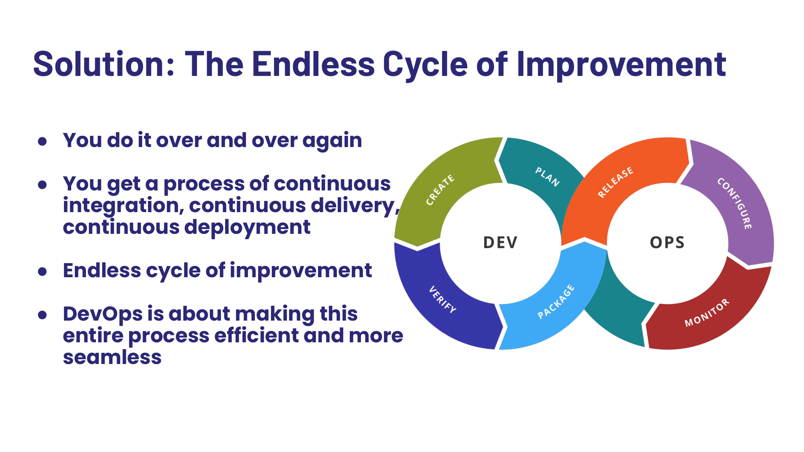
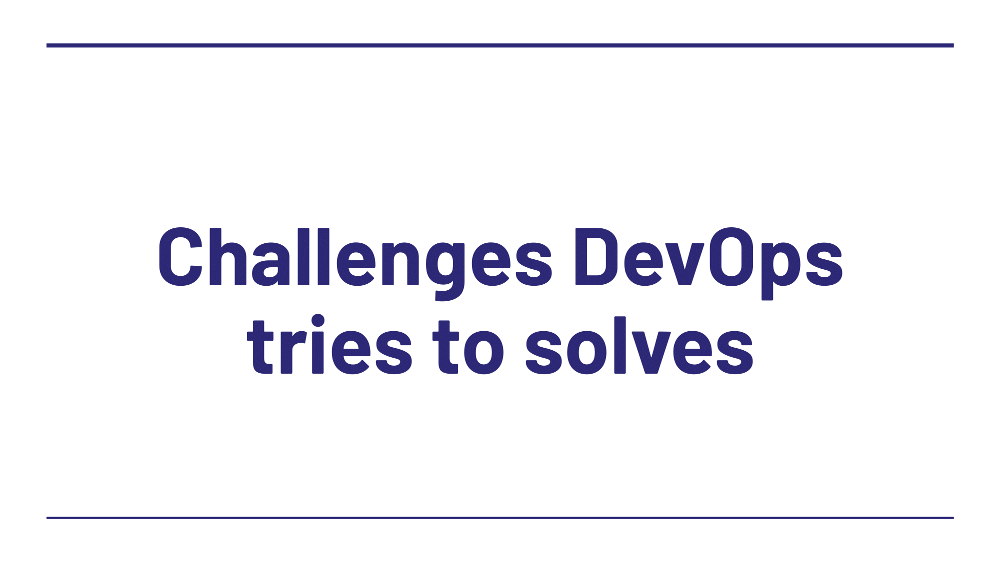
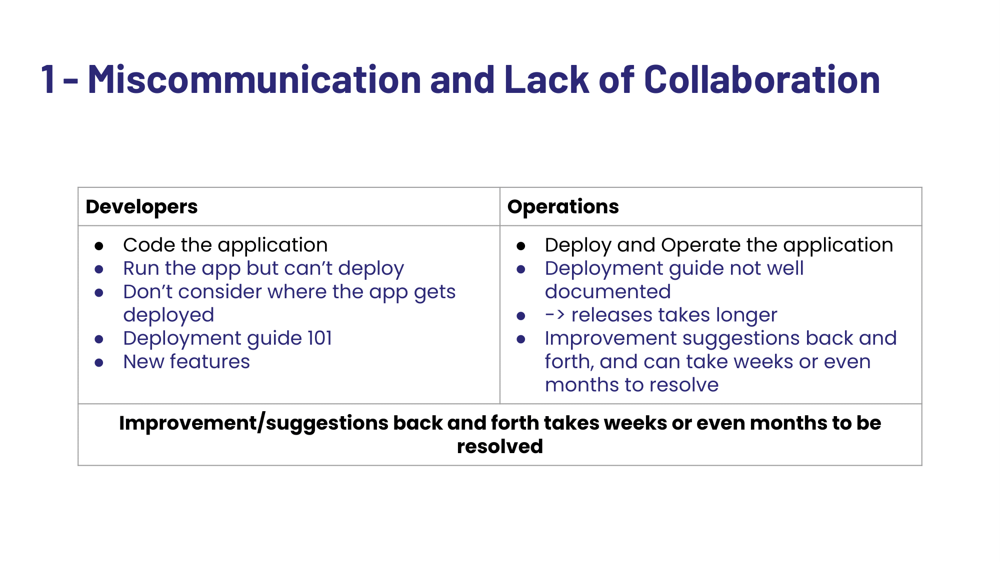
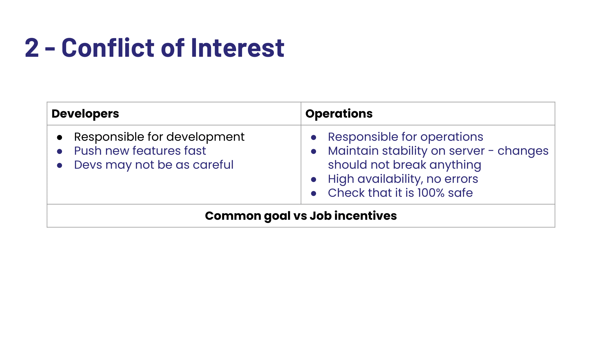
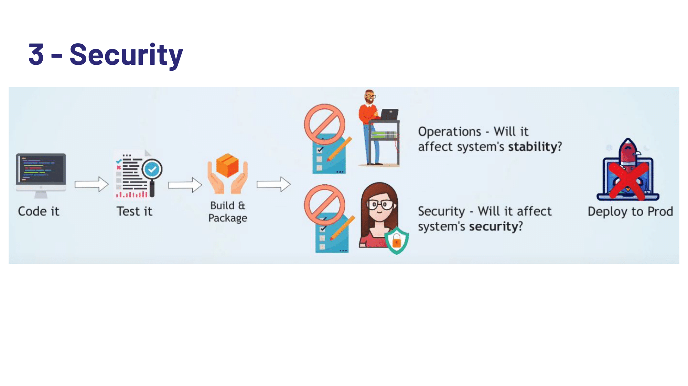
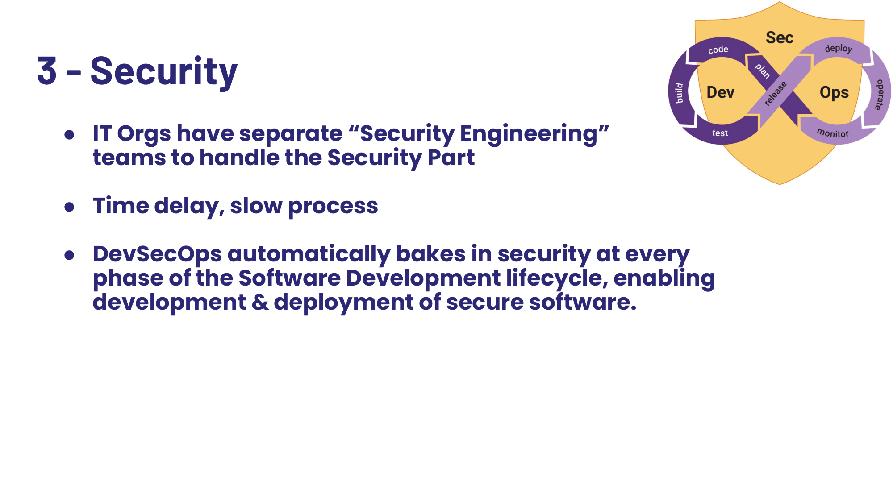
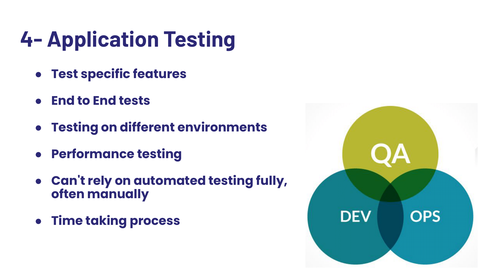
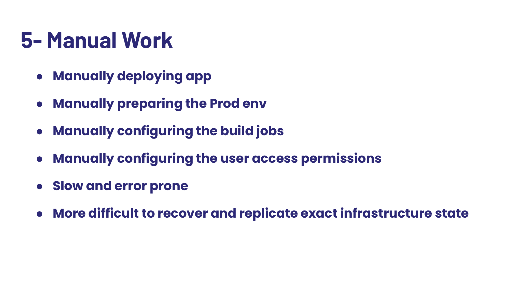
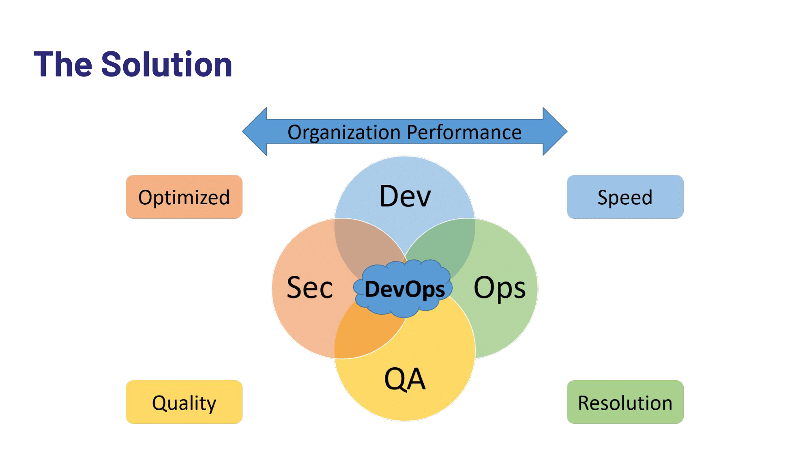
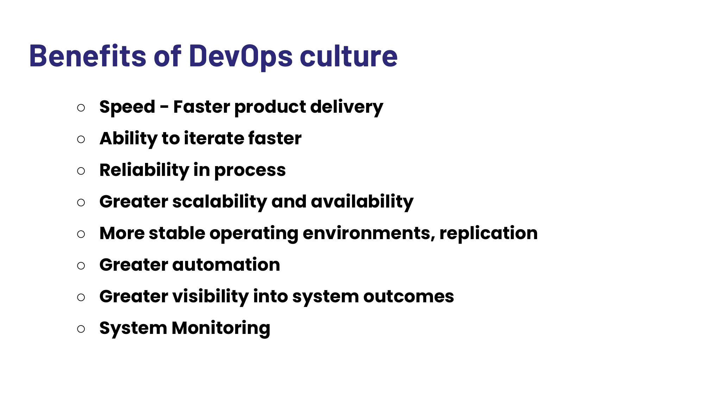
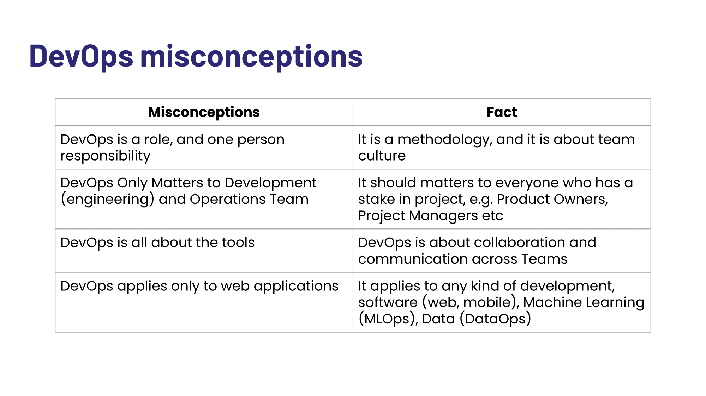
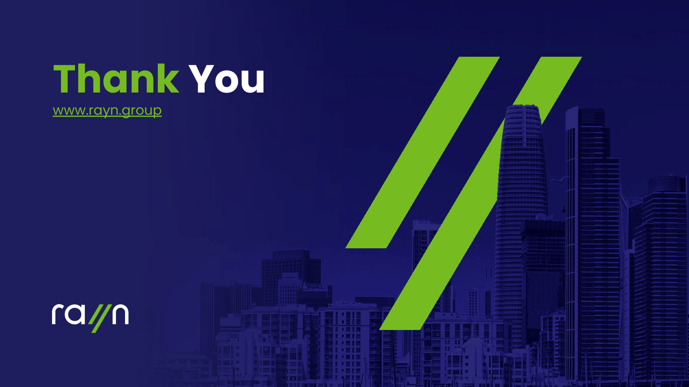
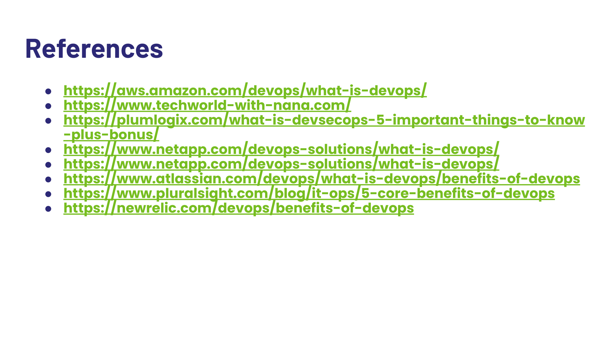

Thank you for reading.
